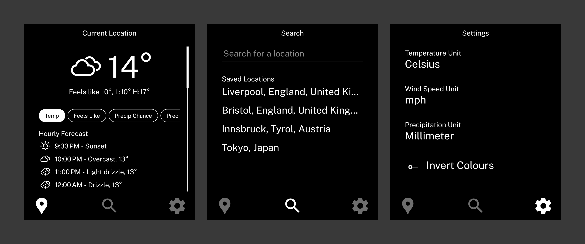

# Weather



An app for the Light Phone III to check the weather.

Weather API: [Open-meteo](https://open-meteo.com/)

Weather Icons: [erikflowers/weather-icons](https://github.com/erikflowers/weather-icons)

Font: [Public Sans](https://public-sans.digital.gov/)

## Building

You can build the .apk with:

```bash
eas build -p android --profile production --local
```

You may need to run `npm install` and `npx expo prebuild --platform android --clean` first.

## Installation

1. Grab the .apk file from [latest release](https://github.com/vandamd/weather/releases/latest).
2. Install the apk how you like! I prefer via adb, e.g. `adb install weatherv1.0.0.apk`.

Note: Developer mode needs to be enabled on the Light Phone III to install third-party apps.
